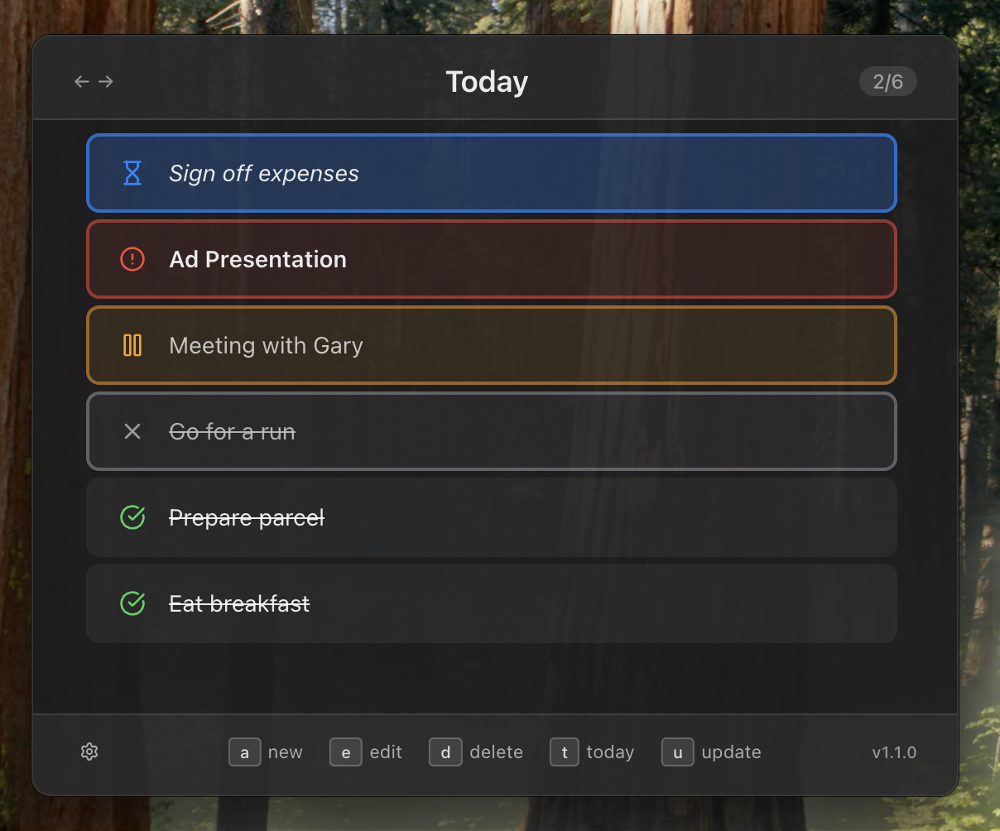

# TodoCmd

A beautiful, keyboard-driven desktop todo application with command palette interface. Built with Electron and React.

[](https://github.com/louisjrdev/todocmd/actions/workflows/release.yml)
[](https://github.com/louisjrdev/todocmd/actions/workflows/test.yml)



## Features

- 🚀 **Command Palette Interface** - Press `Alt+T` globally to open
- ⌨️ **Keyboard Navigation** - Navigate entirely with keyboard
- 🎨 **Modern Glassmorphism UI** - Beautiful, modern design with smooth animations
- 📅 **Date Management** - Switch between days with arrow keys
- 💾 **Persistent Storage** - Todos automatically save and carry over
- 🖥️ **System Tray** - Runs minimized in system tray
- 🔍 **Dock/Taskbar Hidden** - Keeps your workspace clean
- 🌙 **Dark Mode** - Native dark mode support

## Quick Start

### Download & Install

**Latest Release**: [Download from GitHub Releases](https://github.com/louisjrdev/todocmd/releases/latest)

1. **Download** the latest release for your platform:
   - **macOS**: Download `TodoCmd-{version}.dmg`
   - **Windows**: Download `TodoCmd Setup {version}.exe`
   - **Linux**: Download `TodoCmd-{version}.AppImage`

2. **Install** the application:
   - **macOS**: Open DMG and drag to Applications
   - **Windows**: Run the installer
   - **Linux**: Make AppImage executable and run

3. **Launch** with `Alt+T` or from system tray

## Keyboard Shortcuts

### Global Shortcuts
- `Alt+T` - Open/close TodoCmd

### In-App Navigation
- `↑/↓` - Navigate between todos
- `←/→` - Switch between days
- `Enter` - Add new todo (when input is focused)
- `Space` - Toggle todo completion
- `E` - Edit selected todo
- `Delete/Backspace` - Delete selected todo
- `Escape` - Cancel editing or close app

## Usage

### Adding Todos
1. Press `Alt+T` to open TodoCmd
2. Type your todo and press `Enter`
3. The todo is automatically saved

### Managing Todos
- **Complete**: Select a todo and press `Space`
- **Edit**: Select a todo and press `E`
- **Delete**: Select a todo and press `Delete`

### Day Navigation
- Use `←/→` arrow keys to switch between days
- Uncompleted todos automatically carry over to the next day
- View past days to see your completed tasks

## Development

### Prerequisites
- Node.js 16+ and npm
- Git

### Setup
```bash
# Clone the repository
git clone https://github.com/louisjrdev/todocmd.git
cd todocmd

# Install dependencies
npm install

# Start development server
npm start
```

### Building
```bash
# Build for current platform
npm run dist

# Build for specific platforms
npm run dist:mac    # macOS
npm run dist:win    # Windows
npm run dist:linux  # Linux
```

See [BUILD.md](BUILD.md) for detailed build instructions and [RELEASE.md](RELEASE.md) for the automated release process.

### Project Structure
```
todocmd/
├── src/
│   ├── main.ts              # Electron main process
│   ├── preload.ts           # IPC preload script
│   └── renderer/
│       ├── App.tsx          # React UI component
│       ├── App.css          # Styles
│       └── index.html       # HTML template
├── assets/                  # Icons and resources
├── webpack.config.js        # Webpack configuration
└── package.json            # Dependencies and scripts
```

## Technology Stack

- **Electron** - Cross-platform desktop framework
- **React** - UI library with hooks
- **TypeScript** - Type safety
- **Framer Motion** - Smooth animations
- **electron-store** - Data persistence
- **Webpack** - Module bundling

## Contributing

1. Fork the repository
2. Create your feature branch (`git checkout -b feature/amazing-feature`)
3. Commit your changes (`git commit -m 'Add amazing feature'`)
4. Push to the branch (`git push origin feature/amazing-feature`)
5. Open a Pull Request

## License

MIT License - see [LICENSE](LICENSE) file for details.

## Support

- 🐛 **Bug Reports**: [Open an issue](https://github.com/louisjrdev/todocmd/issues)
- 💡 **Feature Requests**: [Open an issue](https://github.com/louisjrdev/todocmd/issues)
- 💬 **Discussions**: [GitHub Discussions](https://github.com/louisjrdev/todocmd/discussions)

---

## Installation & Setup

1. **Clone and install dependencies:**
   ```bash
   git clone https://github.com/louisjrdev/todocmd.git
   cd todocmd
   npm install
   ```

2. **Build the application:**
   ```bash
   npm run build
   ```

3. **Start the application:**
   ```bash
   npm start
   ```

## Development

For development with hot reloading:

```bash
# Start the renderer process dev server
npm run dev:renderer

# In another terminal, start the main process
npm run dev:main

# In a third terminal, start Electron
npm start
```

## Building for Distribution

To create distributable packages:

```bash
npm run dist
```

This will create platform-specific installers in the `release` folder.

## Usage

1. **Open the app**: Press `Alt+Space` from anywhere on your system
2. **Add todos**: Press `n` to add a new todo, type your task, and press `Enter`
3. **Navigate**: Use arrow keys to move between todos and days
4. **Complete todos**: Select a todo and press `Enter` to mark it as completed
5. **Edit todos**: Select a todo and press `e` to edit it
6. **Delete todos**: Select a todo and press `Delete` or `Cmd+Backspace`

## Data Storage

All todo data is stored locally using electron-store. The data is automatically saved whenever you make changes. On first launch of each day, any incomplete todos from the previous day will automatically roll over to today.

## Architecture

- **Main Process** (`src/main.ts`): Handles window management, global shortcuts, and data storage
- **Preload Script** (`src/preload.ts`): Secure bridge between main and renderer processes
- **Renderer Process** (`src/renderer/`): React-based UI with TypeScript
- **Styling** (`src/renderer/App.css`): Modern glassmorphism design with dark mode support

## Customization

You can customize the appearance by modifying `src/renderer/App.css`. The app automatically respects your system's dark/light mode preference.

## Troubleshooting

- **Global shortcut not working**: Make sure no other application is using `Alt+t`
- **App won't start**: Ensure all dependencies are installed with `npm install`
- **Data not persisting**: Check file permissions in your user data directory

## License

MIT License - feel free to use and modify as needed.
